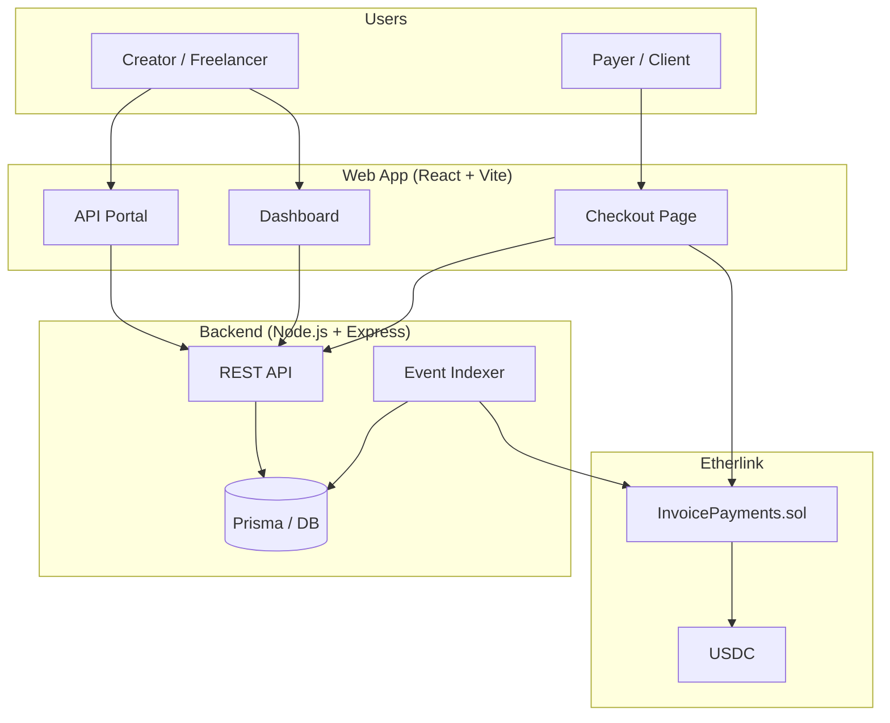
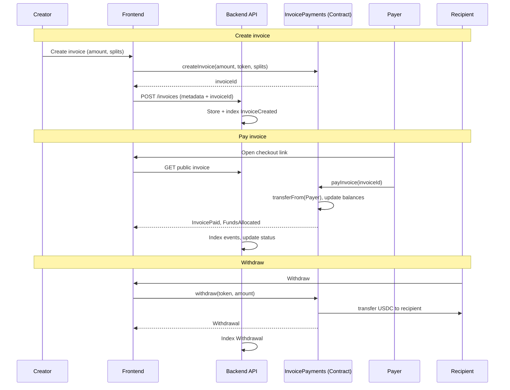
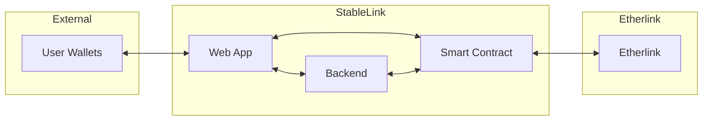

# StableLink

**Etherlink-native stablecoin payment infrastructure for Asia-based freelancers and agencies.**

StableLink is a non-custodial platform that lets freelancers and small teams create programmable stablecoin invoices, accept USDC payments, split funds automatically (e.g. platform fee + team), and withdraw to their own wallets—all on [Etherlink](https://etherlink.com). We are building long-term financial infrastructure, not a custodial wallet or a short-term prototype.

---

## The Problem We Solve

Cross-border payments for freelancers and agencies in Asia are:

| Pain | Impact |
|------|--------|
| **Slow** | 3–7 day settlement; cash flow and planning suffer. |
| **Expensive** | FX spreads, remittance fees, and intermediary costs eat into earnings. |
| **Opaque** | Hard to know when money arrives, who got paid, and at what rate. |
| **Custodial** | Funds often sit in platforms; users don’t hold their own money. |

StableLink addresses this by:

- **On-chain stablecoin invoices** — Create invoices denominated in USDC; payment is a single on-chain transaction.
- **Instant settlement** — Payments settle in seconds on Etherlink; no multi-day banking delays.
- **User keeps custody** — We never hold user funds; payers send to the contract, recipients withdraw to their own wallets.
- **Programmable splits** — Define recipients and percentages (e.g. freelancer 97%, platform 3%); the smart contract enforces splits automatically.

---

## Business Use Cases

1. **Freelancers**  
   Issue invoices in USDC, share a payment link, get paid on Etherlink. No middleman custody; withdraw to your wallet when you want.

2. **Agencies & teams**  
   One invoice, multiple recipients: e.g. 70% to delivery, 20% to ops, 10% to platform. Splits are fixed at creation and executed on payment.

3. **Marketplaces & platforms**  
   Use StableLink as infrastructure: create invoices via API, send links to buyers; settlement and splits happen on-chain. Integrate with REST APIs and webhooks.

4. **Cross-border B2B**  
   Asia-based teams working with global clients: invoice in USDC, avoid FX and slow wires; clients pay once, funds split and withdraw non-custodially.

---

## What We Build (Product)

- **Dashboard** — Create and manage invoices, view payments, withdraw balances (Etherlink).
- **Checkout** — Shareable payment links; payers connect wallet, pay in USDC, see confirmation on-chain.
- **Programmable splits** — At invoice creation, define recipients and percentages (basis points); contract allocates on payment.
- **Non-custodial withdrawals** — Withdraw earned USDC to your wallet anytime; no platform custody.
- **API & webhooks** — Create invoices and listen for events (e.g. paid) for integrations.
- **Organizations & roles** — Team structure, roles, and org-level settings (backend).

**Tech summary:** React (Vite) frontend, Node.js (Express) backend, Prisma + DB for metadata, Solidity smart contract on Etherlink. Money lives on-chain; metadata and product logic off-chain.

---

## Architecture

High-level: **money on-chain, metadata off-chain**. The backend never touches user funds.

**Data flow:**

- **Invoices:** Creator creates invoice (optional: via API). Frontend calls contract `createInvoice(amount, token, splits)`; backend stores metadata and indexes `InvoiceCreated`.
- **Payment:** Payer opens checkout link, connects wallet, calls `payInvoice(invoiceId)`. USDC moves payer → contract; contract updates balances per splits; backend indexes `InvoicePaid` and `FundsAllocated`.
- **Withdraw:** Recipient withdraws from dashboard; frontend calls `withdraw(token, amount)`; contract sends USDC to recipient. Backend indexes `Withdrawal`.

---

## Invoice & Payment Flow (Mermaid)

End-to-end lifecycle from creation to withdrawal.

---

## System Context (Components)

- **Web App:** Dashboard, checkout, API portal; wallet connect (Etherlink); reads contract state and calls contract write methods.
- **Backend:** REST API, event indexer (InvoiceCreated, InvoicePaid, FundsAllocated, Withdrawal), metadata and org/team data. Does not custody funds or sign user transactions.
- **Smart Contract:** `InvoicePayments.sol` — createInvoice, payInvoice, withdraw, cancelInvoice; holds funds only until allocation/withdrawal; uses SafeERC20 and ReentrancyGuard.

---

## Repository Structure

| Path | Description |
|------|-------------|
| `stablelink-frontend/` | React (Vite) app: landing, dashboard, checkout, withdraw, API portal. |
| `backend/` | Node.js + Express: REST API, Prisma, Etherlink event indexer. |
| `contracts/` | Foundry project: `InvoicePayments.sol` (Solidity ^0.8.20, OpenZeppelin). |

---

## Who It’s For

- **Builders and teams in Asia** building or using Web3 payment tools.
- **Freelancers and agencies** who want fast, low-fee, non-custodial stablecoin payments.
- **Product-minded teams** with a working MVP and a path to scale (APIs, webhooks, integrations).

StableLink is **not** a wallet and **not** custodial—it is financial infrastructure built on Etherlink for real-world use.

---

## Quick Start (Developers)

- **Contract:** `cd contracts && forge build`. Deploy to Etherlink (e.g. Shadownet); set `ETHERLINK_RPC_URL` and deployer key.
- **Backend:** `cd backend && npm i && cp .env.example .env` — set `ETHERLINK_RPC_URL`, `DATABASE_URL`, contract address; run `npm run db:push` and `npm run dev`.
- **Frontend:** `cd stablelink-frontend && npm i && cp .env.example .env` — set contract address and chain; run `npm run dev`.

See each repo’s `.env.example` for required variables. Do not commit `.env`.

---

## Links

- [Etherlink](https://etherlink.com) — EVM-compatible chain we build on.
- [Etherlink Docs](https://docs.etherlink.com) — Network info, RPC, deployment.

---

© 2026 StableLink. All rights reserved.
